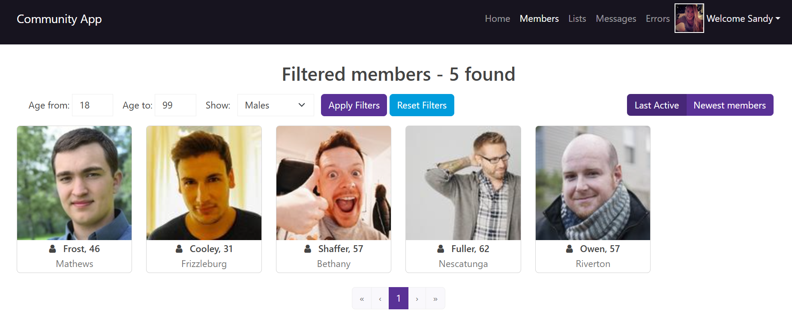
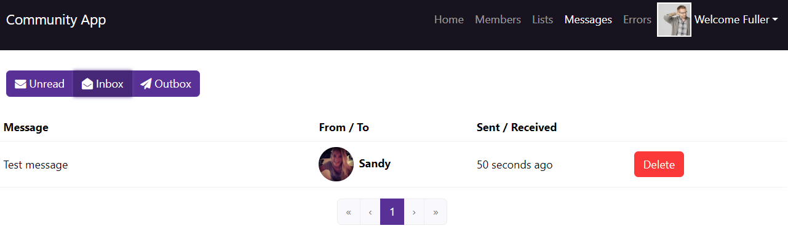
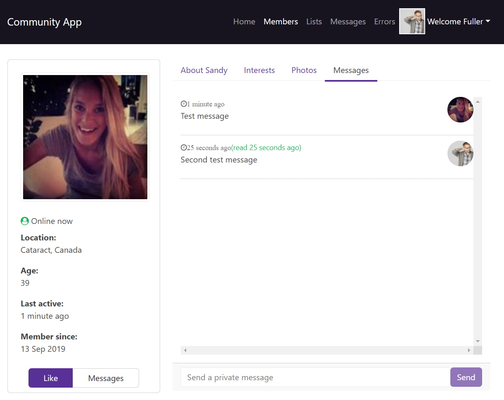

<h1 align="center">Angular & .NET Community App</h1>

## Features
- User registration, login authentication and authorization via JWT Authentication tokens
- Angular Reactive Forms
- Members paging, sorting, filtering, likes
- Message inbox, outbox
- Real time messaging via SignalR WebSockets
- Toastr notifications
- Profile Editing, photo upload
- Admin role, photo approval management

## Used Tech stack/Libraries
- .NET 7.0
- Angular 16.2.12
- SqlLite
- PostgreSQL
- Entity Framework Core
- SignalR
- ASP.NET Core Identity
- Docker
- Bootstrap (ngx-bootstrap)

